小王的学生信息管理系统 - 使用说明
========================================

[toc]


## 01.软件安装

**必须装好这些软件！！！**

**必须装好这些软件！！！**

**必须装好这些软件！！！**

### 1.JDK 21

#### （这里用的27，因为21已经安装完了，所以用27来演示，记得安装的时候用21）

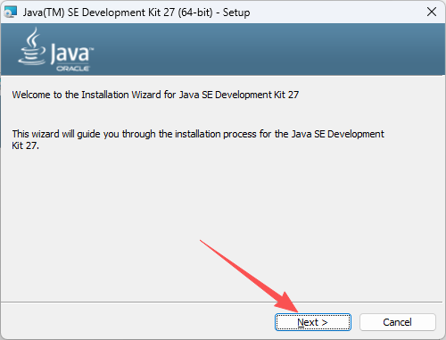

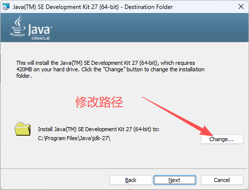

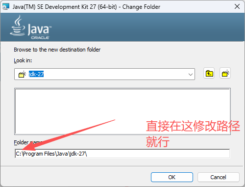


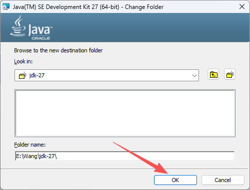


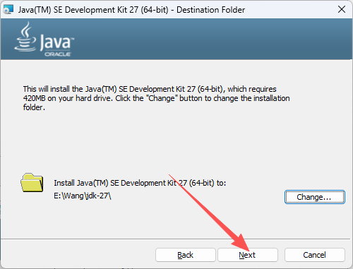

#### 等待安装完成

#### 等待安装完成

#### 等待安装完成


### 2.Maven（IDEA 自带的就行）

### 3.IntelliJ IDEA（或任意 Java 编辑器）

双击直接安装就行，这个没啥要注意的，记得改路径，最后勾选的时候可以全勾选，回头我再单独处理

### 4.MySQL 8.x（root 密码：123456）

#### Mysql修改安装路径

```bash
1. 选择“Custom”：在 “Choosing a Setup Type” 界面，选择 `Custom`，然后点击 Next
2. 添加产品：在 “Select Products” 界面，展开 `MySQL Server`，选择8.0.46版本，点击中间的箭头添加到右侧列表。一定要单击选中右侧列表里的 `MySQL Server`
3. 修改路径：选中后，下方才会出现 `Advanced Options` 链接，点击它，即可在弹出的窗口里分别修改 Install Directory 和 Data Directory
4. 安装MySql：后面顺序安装就可以了，密码记得设置成123456
```


### 5.Node.js 18+

这个直接用我给的包安装就可以了，版本没问题的

### 6.Vue CLI 5（npm install -g @vue/cli）

这个需要在终端执行

win+r输入cmd

```bash
1.在安装路径里新建文件夹
mkdir E:\Wang\npm-global
2.让npm安装到这个目录
npm config set prefix "E:\Wang、npm-global"
3.修改环境变量（看图片）
```


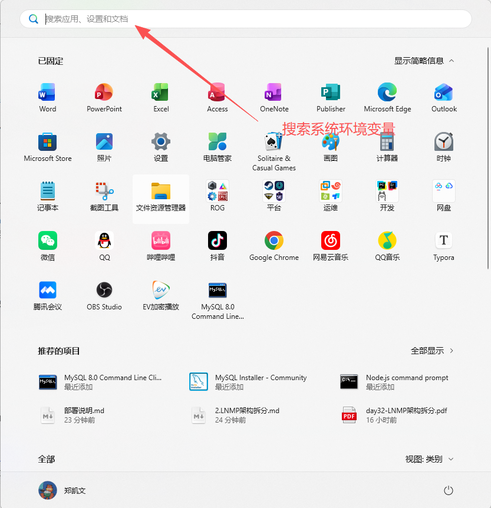

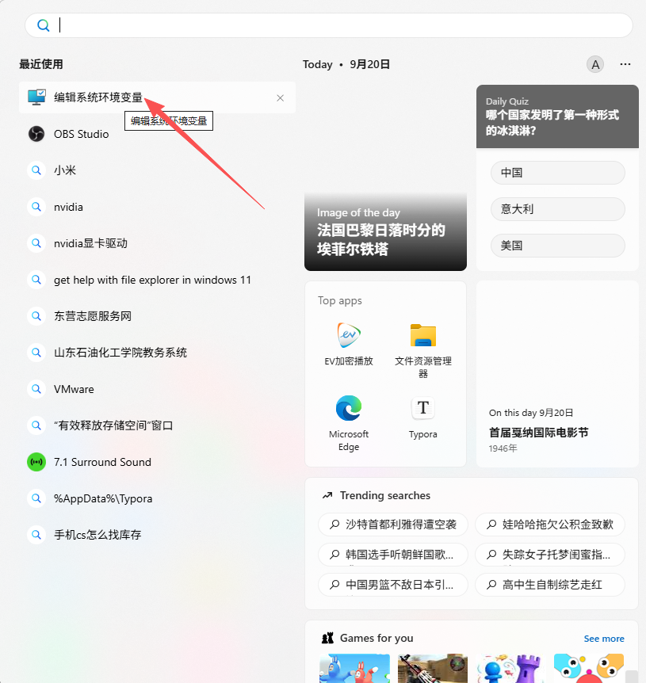

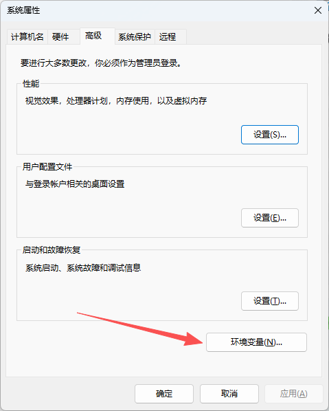

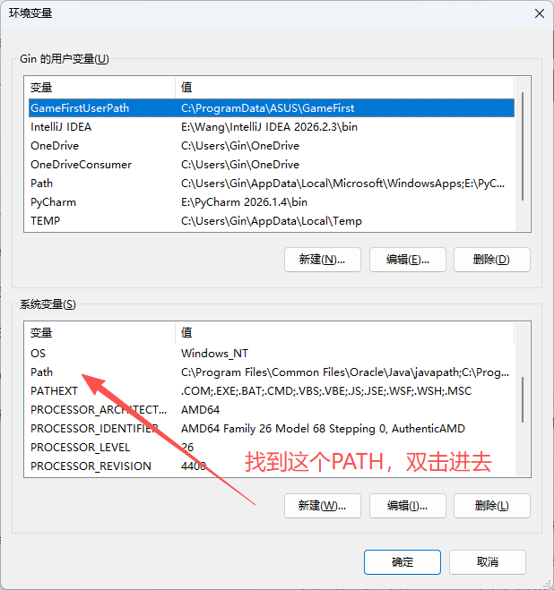

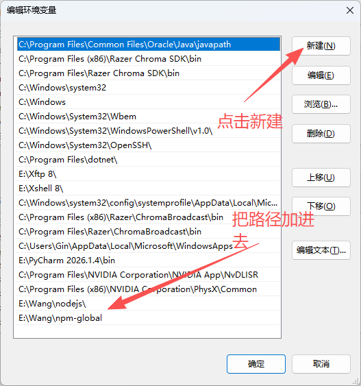

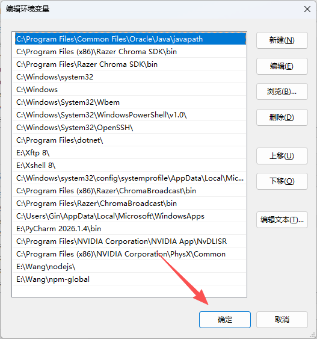

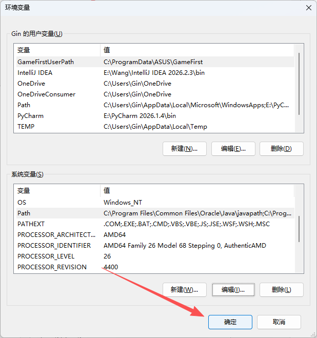

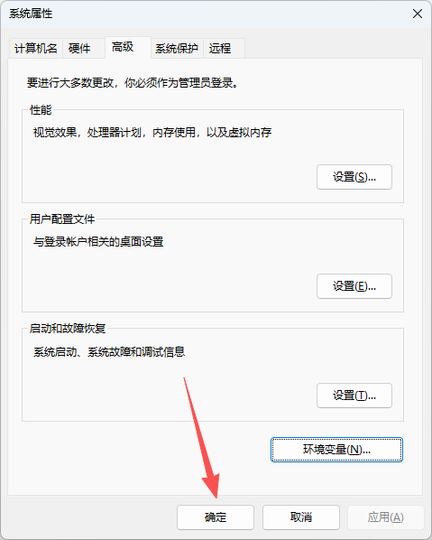

### 7.Ollama + deepseek-r1:1.5b

这个直接用安装包安装就行


## 02.操作步骤

### 1.导入数据库

```bash
1.确认 MySQL 已启动

2.打开 cmd，执行：
mysql -u root -p123456 < D:\StudentSystem\student_db.sql
（路径按实际解压位置改）
```


### 2.启动后端

```bash
1.打开 IDEA

2.File → Open → 选 D:\StudentSystem\Demo

3.等 Maven 依赖下载完（约 5 分钟）

4.运行 DemoApplication

5.看到 "Tomcat started on port 8081" 即成功
```


### 3.启动前端

```bash
1.打开 cmd，执行：
2.cd /d D:\StudentSystem\student-frontend
3.npm install
4.npm run serve

5.看到 "App running at http://localhost:8080" 即成功
```


### 4.启动 AI 对话

```bash
1.新开 cmd：
ollama serve

2.确保已拉模型：
ollama pull deepseek-r1:1.5b
```


### 5.访问系统

```bash
1.浏览器打开：http://localhost:8080
2.登录账号：pro / pro 或 admin / 123456
AI 对话：http://localhost:8081/chat.html
```


## 03.端口说明

```bash
MySQL：3306
后端：8081
前端：8080
Ollama：11434
```

